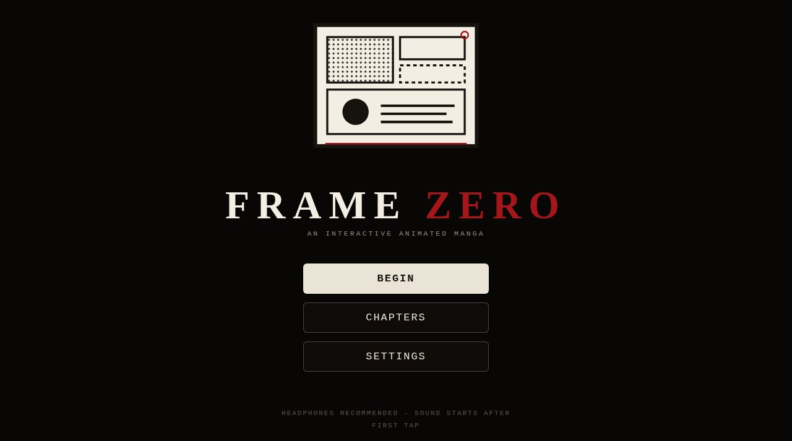

# FRAME ZERO

An interactive animated manga. The pages are not depicting reality - they are controlling it.



**Live:** https://aeiouvcode.github.io/frame-zero/

## About

Five chapters and 46 scenes of motion-comic storytelling with hidden interactions in the panels. Choices near the end decide how the last page is finished. Progress and chapter unlocks save in the browser.

- Chapter select and settings, including reduced motion
- Touch and desktop input
- Atmospheric sound generated at runtime

## Built with

A single self-contained `index.html` (HTML, CSS and JavaScript, about 250 KB). No framework, no dependencies, no build step. A strict Content Security Policy blocks all outbound connections; dynamic art is sanitized before it reaches the DOM.

## Run locally

```sh
git clone https://github.com/aeiouvcode/frame-zero.git
cd frame-zero
python3 -m http.server 8000
```

Then open http://localhost:8000.

Opening `index.html` directly from disk also works, but saves need a normal origin.

## Layout

```
index.html        the complete manga
docs/             README assets
```
